 

---

## &nbsp;✦ &nbsp;Sobre Mí

  Soy <strong>Dalton</strong>, un desarrollador apasionado por crear 
  soluciones integrales, desde interfaces fluidas hasta hardware interactivo.

  Vivo entre el desarrollo móvil, el backend y la robótica. 
  Creo que el código bien escrito es un arte en sí mismo.

- 🌱 &nbsp;Explorando constantemente con Flutter, Node.js y Python.
- 🔭 &nbsp;Construyendo experiencias inmersivas y sistemas IoT.
- ⚔️ &nbsp;Inspirado por el diseño minimalista, la lógica limpia y la accesibilidad.
- 📍 &nbsp;Tulcán, Ecuador

 
 

---

## &nbsp;✦ &nbsp;Stack Tecnológico

 

 
 

---

## &nbsp;✦ &nbsp;GitHub Stats

 

<table>
  <tr>
    <td style="border: none;">
      
    </td>
    <td style="border: none;">
      
    </td>
  </tr>
</table>

 

---

## &nbsp;✦ &nbsp;Misiones Activas

 

&nbsp;

  

---

## &nbsp;✦ &nbsp;Conéctate Conmigo

 

 

---

